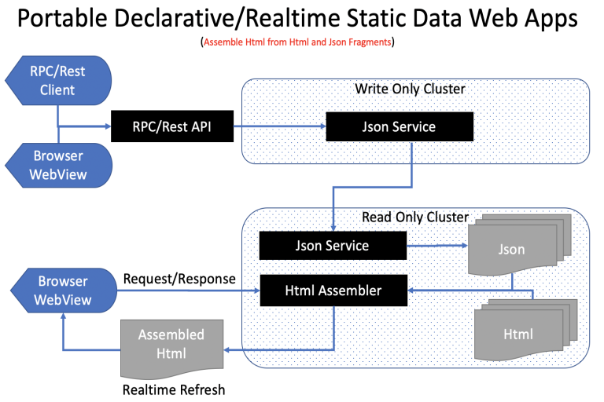

# Declarative Abstraction for Assembling Static Web Apps 

## Can we Declaratively **Assemble AppWebs** from Reusable Html + Json(Data) Components 

 

# Goals

**Assemble** Reusable Html + Json Components

#### 1. Declaratively Build Static UI, Static Data UI from Reusable Html + Json Components

#### 2. Platform/Framework Independent Abstraction defined in Html/Json Files and Folder Organization using multi-platform/multi-language runtimes.

Ultimately To Separate Web Apps into ReadOnly and WriteOnly Cluster during deployment

 "Architecuture for Splitting WebApps into ReadOnly and WriteOnly Cluster").

# Open Source (MIT)

Currently the tool consists of runtime which implements the abstraction, application built using that abstraction and also a tool for facilitating hot reloading.

The runtime will be extracted from the tool and  the source will be published as MIT License.

The tool and the application using the runtime/abstraction will be proprietory.

# Online Demo

Some intersting links to showcase the abstraction. View the hidden Inspect Toolbar at the top to know other features

Main Page explaining the abstraction
#### Main : https://appgui.fly.dev

Just add Meta to the end of the page to view the Metadata Json
#### Meta : https://appgui.fly.dev/meta

Test Page to show case the different abstractions
#### Test : https://appgui.fly.dev/Test/Main

# Getting Started

Clone the repo and run the appropriate **appweb.web** asp.net core application for the respective platform

On first run the application will extract the Index, Template and Test AppSite's and run the asp.net core kestrel server under port 7000

Run the Docker Image **arshucs/appweb** as below
#### docker run --publish 8080:8080 arshucs/appweb:latest

# Abstraction for Assembling Static UI from Html Components

 

1. Abstraction for Composing from Html Fragements

<pre>
Index.html
    {{MainHeader}}    
    {{MainContent}}
    {{MainFooter}}
</pre>

    The Runtime will search the wwwroot folder arranged in correct folder structure and auto replace the mustache definition with the actual html component recursively. Reorganizing the Html Components in the appropirate folders has no impact to composition.

2. Abstraction for Composing where the Parent Component is composed with Child Components based on Context

    When Context is https://Gluuie.com/Index/Main vs https://Gluuie.com/Index/About

    MetaData of the Pages are    
    https://Gluuie.com/Index/Main/Meta    
    https://Gluuie.com/Index/About/Meta

    The Main Prefix of a Mustache is replaced with the AppView Context (About) to render a different page retaining the same index.html page.

<pre>
Index.html
    {{MainHeader}}      =>      {{MainHeader}}
    {{MainContent}}     =>      {{AboutContent}} 
    {{MainFooter}}      =>      {{MainFooter}}
</pre>

# Abstraction for Assembling Static Data UI from Html + Json Components

 

1. Abstraction for Composing from Html + Json Property Fragemnts

<pre>
Title.html
    {{$Title}}

Title.json
    {
        "Title" : "Name"
    }
</pre>

2. Abstraction for Composing from Html + Json Array Fragemnts

<pre>
List.html
    {{@List}}
        {{$TaskName}}
    {{/List}}

List.json
    {
        "List" : [
            {
                "TaskName" : "Task 1"
            }
        ]
    }
</pre>

# Abstraction for Assembling Dynamic/Realtime UI from Html + Json Components

 

1. Abstractions for Assembling Dynamic Components is by adding a {{ViewPlaceHolder}} where the system will auto generate a View ID for accessing from Javascript

<pre>
Center.html
    &lt;div&gt;     
        {{ViewPlaceHolder}}
    &lt;/div&gt;     
</pre>

2. Currently state flow between components is completed. State flow between global state, context state, parent state and component state where the component state overwrite all the previous state is implemented. Viewing the Metadata of the Page gives the State Flow.

<pre>
    Global State
        Context State
            Parent Components State
                Component State
</pre>

# Component Organization 

 

Components should be grouped into AppSites and AppViews Folders for providing URL Context

    AppSite's are grouped under AppSites Directory under the Root Folder 

    AppView's can be grouped under Views/ViewsDefer Directory under Respective AppSite Directory.

    Components can be added to Component Directory under Respective AppSite Directory 

    Page Components can be added to AppView Directory under Views/ViewsDefer Directory

    Url to access a page is https://Domain/AppSite/AppView
